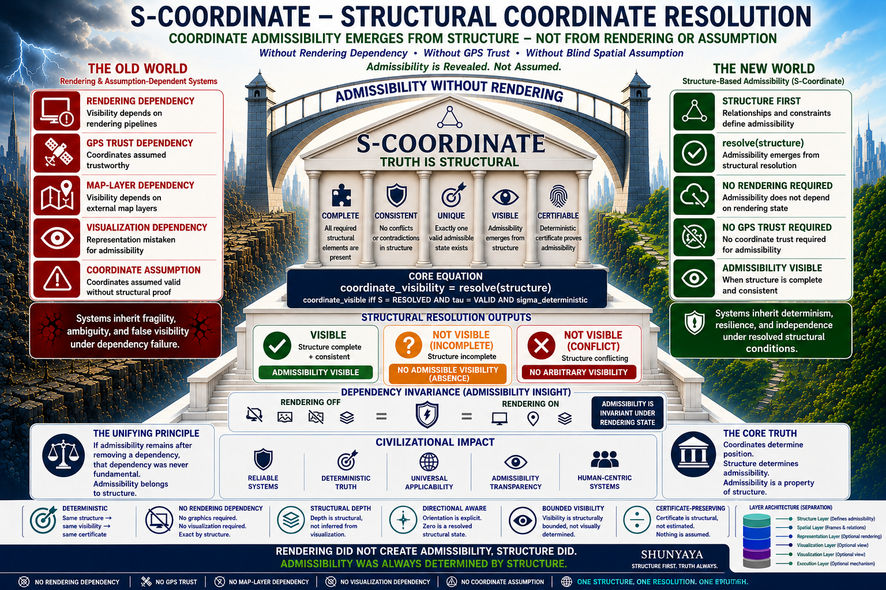

# ⭐ **S-Coordinate**

**Structural Coordinate Resolution**  
**Coordinates Become Visible Only When Structurally Admissible**


> **A coordinate can exist numerically and still be structurally inadmissible.**  
> S-Coordinate demonstrates it in ~540 bytes.

**Reveals coordinate visibility from structure — independent of blind coordinate assumption.**

---

This reference engine demonstrates a **strict invariant**:

> `coordinate_visible iff S = RESOLVED AND tau = VALID AND sigma_deterministic`

**Coordinates show where. Structure decides whether.**

---

## ⚡ **The 30-Second Revolution**

Traditional systems assume:

`if (x, y, z) exists -> point is real`

**S-Coordinate demonstrates:**

`if (x, y, z) exists -> resolve structure first`

The exact same numbers can become:

- `VISIBLE` (structurally admissible)
- `NOT_VISIBLE` (structurally inadmissible)

**Same point. Same numbers. Different structure. Different reality.**

Run the demo once.

You will never look at coordinates the same way again.

---

## 🌐 **S-Coordinate — Structural Coordinate Resolution**

**Where Structure Resolves and Coordinate Reality Becomes Visible**

S-Coordinate removes the silent assumption that a coordinate is real merely because its numbers exist.

A point may have valid `x`, `y`, and `z` values.

But S-Coordinate asks a deeper question:

**Was this coordinate structurally allowed to become visible?**

**Deterministic • Structure-Based • Coordinate-Admissible • Replay-Certified • No Forced Spatial Reality**

---

## ⚡ **The Core Claim**

A coordinate can exist numerically and still be **structurally inadmissible**.

Classical systems silently treat numerical existence as sufficient for trust.

S-Coordinate treats it as the starting point — not the destination.

**This is not an optimization. It is the removal of a hidden, dangerous assumption.**

---

## 🧱 **Core Principle**

`coordinate_visible iff S = RESOLVED AND tau = VALID AND sigma_deterministic`

S-Coordinate establishes that coordinate visibility is determined by structural admissibility — not by numerical position alone.

Classical coordinates remain exact.

S-Coordinate adds structural permission.

---

## 🧭 **Visual Overview**



---

## 🚀 **The Core Insight**

Classical coordinates ask:

`Where is the point?`

S-Coordinate asks:

`Was this point structurally allowed to become real?`

---

## 🧩 **Classical Coordinate vs Structural Coordinate**

Classical coordinate:

`(x, y, z)`

Structural coordinate:

`(x, y, z, S, tau, sigma)`

Where:

- `x, y, z` = classical position
- `S` = structural admissibility state
- `tau` = structural transition validity
- `sigma` = deterministic structural certificate

Interpretation:

`(x, y, z)` tells where.

`(S, tau, sigma)` determines whether that position becomes structurally visible.

---

## 🧭 **Compatibility with Classical Coordinates**

S-Coordinate does not replace classical coordinate systems.

Classical coordinates remain:

- mathematically valid
- geometrically exact
- fully usable for existing systems

S-Coordinate introduces an additional structural layer:

coordinate admissibility.

This means:

`classical position` remains unchanged

while:

`structural visibility`

is evaluated separately.

The goal is not to replace coordinates.

The goal is to determine when coordinates become structurally trusted.

---

## ⚡ **The Core Breakthrough**

`coordinate != admissible reality`

Classical coordinates determine position.

S-Coordinate determines whether that position becomes structurally visible.

`coordinate_visibility = resolve(structure)`

Coordinates show where.

Structure decides whether.

---

## 🧱 **Structural Vocabulary**

### 🧩 **x, y, z**

Classical coordinate values.

These values preserve ordinary spatial position.

### 🧩 **S**

Structural admissibility state.

Typical values:

`RESOLVED`

`INCOMPLETE`

`CONFLICT`

Only `RESOLVED` can permit visibility.

### 🧩 **tau**

Structural transition state.

Typical value:

`VALID`

A coordinate may be numerically valid but transitionally invalid.

### 🔐 **sigma**

Deterministic structural certificate.

Generated from the coordinate structure.

`same structure -> same sigma`

`different structure -> different sigma`

### 👁 **coordinate_visible**

True only when structural admissibility, transition validity, and deterministic identity are satisfied.

### 🟢 **VISIBLE**

Structure resolved + transition valid + certificate deterministic.

The coordinate becomes structurally visible.

### ⚫ **NOT_VISIBLE**

Structure incomplete, conflicting, or transitionally invalid.

The coordinate is not erased.

It is structurally inadmissible.

---

## 🧠 **The Critical Shift**

Traditional systems assume:

`coordinate -> render`

S-Coordinate requires:

`coordinate -> resolve -> certify -> render`

That additional structural layer is the breakthrough.

Rendering no longer implies admissibility.

Visibility must be earned by structure.

---

## 🧪 **Try It in 30 Seconds**

Run:

```
python demo/s_coordinate.py
```

Expected output for admissible structure:

`VISIBLE`

`certificate: cd51155c6ec1dfcd`

Now change:

`S = "RESOLVED"`

to:

`S = "INCOMPLETE"`

Run again:

```
python demo/s_coordinate.py
```

Expected output:

`NOT_VISIBLE`

The coordinate values still exist.

But the coordinate is not structurally allowed to become visible.

---

## 🧩 **Reference Kernel**

`demo/s_coordinate.py`

This minimal kernel proves the invariant:

`coordinate_visible iff S = RESOLVED AND tau = VALID AND sigma_deterministic`

The kernel is intentionally tiny.

Its purpose is not to become a large geometry library.

Its purpose is to isolate one structural truth:

`visibility is governed before rendering occurs`

**position alone is not admissible reality.**

---

## 🧭 **Visual Demo**

Run:

```
python demo/s_coordinate_visual.py
```

Expected result:

A structural coordinate plot appears.

If structure is admissible:

`VISIBLE`

If structure is incomplete or conflicting:

`NOT_VISIBLE`

The graph does not prove the coordinate.

The resolver proves it first.

The graph only renders what structure already admitted.

---

## 🧱 **Layer Separation**

**Coordinate Layer:**

Defines `x`, `y`, and `z`.

**Structure Layer:**

Defines `S`, `tau`, and `sigma`.

**Rendering Layer:**

Displays the coordinate only after structural resolution.

**S-Coordinate operates at the Structure Layer.**

---

## 🔍 **Truth vs Position**

S-Coordinate determines coordinate admissibility — not numerical position.

The coordinate may exist.

The coordinate may be mathematically valid.

The coordinate may be renderable.

But it becomes structurally visible only when:

`S = RESOLVED`

`tau = VALID`

`sigma_deterministic = True`

---

## 🔥 **Break This S-Coordinate**

If numerical coordinates alone are sufficient for trusted coordinate visibility, this invariant must fail:

`same structure -> same visibility -> same sigma`

Or demonstrate:

`incomplete structure -> forced visibility`

`conflicting structure -> trusted coordinate`

`same structure -> different certificate`

`same coordinate + different structure -> same structural reality`

If none occur, coordinate numbers alone were never sufficient for structural reality.

---

## 🔬 **Why This Is Scientifically Meaningful**

S-Coordinate is intentionally designed to be falsifiable.

The core invariant can be independently tested:

`same structure -> same visibility -> same certificate`

To invalidate the model, demonstrate any of the following:

- identical structure producing different visibility
- identical structure producing different certificate
- incomplete structure producing trusted visibility
- conflicting structure producing trusted visibility
- rendering state altering admissibility for identical structure

If none occur under replay verification,
then coordinate admissibility in this model is structurally determined —
not blindly inherited from numerical position alone.

This is not a philosophical claim.

It is an executable structural claim.

---

## ⚡ **The Critical Line**

Across spatial systems:

remove blind coordinate assumption -> structure remains -> admissible visibility preserved

Nothing is replaced.

Nothing is approximated.

Nothing is forced.

Only the hidden dependency was removed.

---

## 🌍 **Why This Matters**

Modern systems increasingly depend on coordinates that may appear valid but may not be structurally trustworthy.

Examples:

- GPS drift
- GPS spoofing
- drone navigation
- autonomous vehicles
- robotics
- digital twins
- AI-generated spatial outputs
- synthetic maps
- simulation coordinates
- weather tracks
- radar overlays
- medical imaging coordinates
- infrastructure monitoring
- safety-critical spatial systems

Classical systems often assume:

`visible coordinate = trusted coordinate`

S-Coordinate breaks that dependency.

It introduces:

`trusted coordinate iff structurally admissible coordinate`

---

## 🔥 **Real-World Impact — Where Silence Saves Lives**

| Scenario | Traditional Behavior | S-Coordinate Behavior | Outcome |
|---|---|---|---|
| GPS spoofing attack | Coordinates render -> system trusts | Structure incomplete/conflicting -> `NOT_VISIBLE` | Attack blocked |
| AI-generated fake coordinate | Rendered and used downstream | Structure unresolved -> `NOT_VISIBLE` | Hallucination rejected |
| Premature hurricane forecast | Cone drawn on incomplete data | Storm structure not mature -> no forecast | Public protected from false confidence |
| Drone in GPS-denied environment | Position drifts -> unsafe navigation | Structural frame invalid -> `NOT_VISIBLE` | Safe abort triggered |
| Digital twin sensor fusion | Conflicting sensor data averaged | Conflict detected -> `NOT_VISIBLE` | Integrity preserved |

**S-Coordinate turns "I see it on the map" into "I trust it because structure permits it."**

---

## 🧠 **The Structural Shift**

For centuries, coordinate systems answered:

`Where?`

Modern systems must also answer:

`Should this coordinate become trusted reality?`

Classical systems assume:

`visible coordinate = trusted coordinate`

S-Coordinate breaks that dependency.

A coordinate may:

- numerically exist
- geometrically exist
- visually render

and still remain:

`NOT_VISIBLE`

because structural admissibility was not satisfied.

This is the shift from:

`coordinate -> render`

to:

`coordinate -> resolve -> certify -> render`

Coordinates show where.

Structure decides whether.

---

## 🛡️ **Safety Through Absence — The Most Responsible Output**

When structure is incomplete or inconsistent:

`coordinate_visible = False`

This is **not** a failure.

This is **structural safety**.

- `incomplete -> NOT_VISIBLE`
- `conflict -> NOT_VISIBLE`
- `resolved + valid -> VISIBLE`

**Absence is truth. Silence is valid output.**

In safety-critical systems, the ability to say:

"I do not yet have enough structural certainty"

is one of the most valuable features an engine can possess.

---

## 🧩 **Structural Collapse Guarantee**

S-Coordinate does not modify classical coordinates.

It preserves them.

`phi((m, a, s)) = m`

Where:

- `m` = classical coordinate position
- `a` = alignment / frame admissibility
- `s` = structural state

No new coordinate is created.

No approximation is introduced.

Classical position remains exact.

Structure governs visibility.

---

## 🧠 **Practical Interpretation**

Use existing coordinate systems for position.

Use S-Coordinate to determine whether the coordinate is structurally admissible.

---

## 🧭 **Structural Model**

`resolve(coordinate_structure) ->`

`VISIBLE`

`NOT_VISIBLE`

The coordinate becomes visible only when structure resolves.

---

## 🛡 **Structural Safety & Guarantees**

S-Coordinate never forces coordinate visibility.

`incomplete -> NOT_VISIBLE`

`conflict -> NOT_VISIBLE`

`resolved + valid -> VISIBLE`

`same structure -> same visibility -> same sigma`

Reproducible across runs.

Deterministic by structure.

---

## 🔥 **Deterministic Invariant**

`same structure -> same coordinate visibility -> same certificate`

No GPS assumption, rendering layer, map layer, or external authority can alter this invariant inside the reference model.

Only structure determines visibility.

---

## 📊 **Comparison**

| Model | Coordinate Exists | Structure-Based Visibility | Deterministic Certificate |
|---|---:|---:|---:|
| Classical Coordinates | Yes | No | No |
| GPS / Map Systems | Yes | Partial | Conditional |
| Simulation Coordinates | Yes | Partial | Conditional |
| S-Coordinate | Yes | Yes | Yes |

---

## 🧩 **Reference Demonstration**

**Scenario 1 — Valid Structure**

`S = RESOLVED`

`tau = VALID`

Result:

`VISIBLE`

---

**Scenario 2 — Incomplete Structure**

`S = INCOMPLETE`

`tau = VALID`

Result:

`NOT_VISIBLE`

---

**Scenario 3 — Conflicting Structure**

`S = CONFLICT`

`tau = VALID`

Result:

`NOT_VISIBLE`

---

## 🔹 **What This Output Represents**

Coordinate visibility appears only when structure resolves.

Structure governs admissibility.

Outputs are deterministic.

Certificates are replayable.

---

## 🧭 **Framework & References**

### **Docs**

- [Quickstart](docs/Quickstart.md)
- [FAQ](docs/FAQ.md)
- [Proof Sketch](docs/Proof-Sketch.md)
- [Architecture Notes](docs/S-Coordinate-Architecture-Notes.md)
- [S-Coordinate Framework Document](docs/S-Coordinate_v1.2.pdf)
- [S-Coordinate Concept Diagram](docs/S-Coordinate-Diagram.png)

---

**Note:**

Certificate identity shown in diagrams is illustrative unless generated directly from the reference script.

In Phase I, certificate identity depends on structural encoding.

Canonical identity is a future extension.

---

### **Framework**

- [Dependency Elimination Framework](docs/Dependency-Elimination-Framework.png)
- [Shunyaya Structural Stack](docs/Shunyaya-Structural-Stack.png)

---

S-Coordinate is part of the **Dependency Elimination Framework**, where:

`coordinate_visibility = resolve(structure)`

Removing the assumed dependency between numerical coordinate and trusted reality does not break coordinate truth.

It reveals that coordinate trust was always structural.

---

## 🧪 **Demo**

- [s_coordinate.py](demo/s_coordinate.py)
- [s_coordinate_visual.py](demo/s_coordinate_visual.py)

---

## 🖼 **Generated Structural Artifacts**

### **Coordinate Visibility Outputs**

- [S_COORDINATE_VISIBLE.png](outputs/S_COORDINATE_VISIBLE.png)

---

These artifacts are generated directly from resolved structure.

They are not illustrative screenshots.

They are deterministic structural visibility artifacts.

`same structure -> same visibility -> same certificate`

The resolver determines coordinate admissibility first.

The renderer only reveals what structure already admitted.

---

## 🔐 **Verification**

- [VERIFY.txt](VERIFY/VERIFY.txt)
- [FREEZE_DEMO_SHA256.txt](VERIFY/FREEZE_DEMO_SHA256.txt)

---

## 📁 **Repository Structure**

- `demo/` — minimal S-Coordinate reference kernel and visual demo
- `docs/` — conceptual, framework, and diagram documentation
- `VERIFY/` — reproducibility and integrity checks
- `README.md` — full repository explanation
- `LICENSE` — repository license

---

## 🔐 **Verification & Reproducibility**

### **Quick Determinism Check**

Run:

`python demo/s_coordinate.py`

Run again:

`python demo/s_coordinate.py`

Expected:

Same structure produces same visibility and same certificate.

---

### **Expected Valid Output**

`VISIBLE`

`certificate: cd51155c6ec1dfcd`

---

### **Structural Rejection Check**

Modify:

`S = "RESOLVED"`

to:

`S = "INCOMPLETE"`

Run:

`python demo/s_coordinate.py`

Expected:

`NOT_VISIBLE`

The coordinate remains numerically valid.

But visibility is structurally rejected.

---

### **File Integrity Check**

Windows:

`certutil -hashfile demo\s_coordinate.py SHA256`

Linux/macOS:

`sha256sum demo/s_coordinate.py`

The hash should match:

`VERIFY/FREEZE_DEMO_SHA256.txt`

---

## 🧱 **From Minimal Proof to Spatial Systems**

This reference engine isolates the structural invariant.

It is the smallest visible proof.

Minimal engines isolate the truth.

Full systems demonstrate it at scale.

Future S-Coordinate systems may expand into:

- structural geometry
- admissible lines
- admissible surfaces
- structural maps
- spatial certificate systems
- GPS spoof resistance
- AI spatial output validation
- drone navigation gates
- robotics coordinate trust
- simulation reality checks
- digital twin admissibility
- structural weather tracks
- medical imaging coordinate admissibility
- safety-critical spatial systems

The invariant remains identical:

`same structure -> same coordinate visibility`

The principle does not change with scale.

Only its visibility increases.

---

## 🌪 **Bridge to SLANG-Hurricane**

S-Coordinate provides the spatial admissibility layer for dynamic structural weather systems.

SLANG-Hurricane demonstrates:

`forecast_visible iff structure_mature`

S-Coordinate demonstrates:

`coordinate_visible iff S = RESOLVED AND tau = VALID AND sigma_deterministic`

Together:

`storm_forecast_visible iff coordinate_structure_mature AND storm_structure_mature`

Where:

`coordinate_structure_mature = S = RESOLVED AND tau = VALID AND sigma_deterministic`

and:

`storm_structure_mature = track_ready AND motion_coherent AND pressure_coherent AND wind_coherent AND window_valid AND basin_valid`

This means:

A storm coordinate is not trusted merely because latitude and longitude exist.

It becomes visible only when storm structure permits it.

---

## 🌪 **Structural Weather Interpretation (SLANG-Hurricane Bridge)**

Traditional systems ask:

**“Where is the storm going?”**

Structural systems first ask:

**“Is the storm path structurally mature enough to speak?”**

S-Coordinate supplies the spatial admissibility layer.

SLANG-Hurricane supplies the storm-structure maturity layer.

Together they enforce one structural guarantee:

> A storm coordinate is not trusted merely because latitude and longitude exist.  
> It becomes visible only when **both** coordinate structure **and** storm structure are mature.

This is how forecasting moves from “prediction pressure” to **structural responsibility**.

---

## 🌍 **Civilizational Impact**

From coordinate-dependent systems to structurally admissible spatial reality.

Traditional spatial systems inherit:

Assumption • Premature rendering • Hidden trust • Coordinate spoof risk

S-Coordinate systems inherit:

Determinism • Structural clarity • Replay identity • Admissibility before visibility

This is not optimization.

It is dependency elimination.

Coordinates did not create trusted reality.

Structure admits reality.

---

## 🧾 **Structural Lineage**

| System | Structural Shift |
|---|---|
| SLANG | correctness without workflow |
| STIME | correctness without clocks |
| STINT | correctness without continuous connectivity |
| STILE | correctness without communication |
| STRAL | transition without traversal |
| SVARE | value correctness without computation |
| STIC | correctness without cloud dependency |
| STRUMER | media without editing |
| S-Coordinate | coordinate visibility without blind spatial assumption |

---

## ⚖️ **What S-Coordinate Is / Claims / Does Not Claim**

### **S-Coordinate IS:**

a structural coordinate admissibility model

a deterministic proof that coordinate visibility can be governed by structure

a model where the same coordinate structure always produces the same visibility and certificate

a model where incomplete or conflicting structure produces no trusted coordinate visibility

a minimal reference model for coordinate visibility without blind spatial assumption

a Phase I demonstration of structure-first coordinate admissibility

part of the Shunyaya Dependency Elimination Framework

---

### **S-Coordinate CLAIMS:**

Coordinate visibility can be determined from structural admissibility

Numerical coordinates alone are not sufficient to establish trusted structural reality

Structure — not rendering — defines coordinate admissibility

Same structure produces same visibility and same certificate

Different structure produces different certificate

---

### **S-Coordinate IS NOT:**

a replacement for classical coordinate systems

a replacement for GPS

a replacement for maps

a production navigation system

a certified aviation, medical, military, emergency, or safety-critical system

a full geometry engine

a full simulation engine

a probabilistic localization system

a performance optimization model

---

### **S-Coordinate DOES NOT CLAIM:**

that coordinates are invalid without S-Coordinate

that GPS, maps, or geometric systems are unnecessary

that the Phase I kernel is production-ready for safety-critical deployment

that the reference certificate is an externally signed cryptographic proof

that canonical identity is complete in Phase I

that structural admissibility replaces domain authority

---

## 🔬 **PHASE I ASSUMPTIONS AND VERIFICATION**

### **What S-Coordinate assumes in Phase I:**

Structure definitions are provided by the caller and treated as authoritative.

The reference implementation uses only Python standard library for the minimal kernel.

Certificates are deterministic structural fingerprints.

Certificates are not externally signed cryptographic attestations.

The model applies to structure-resolvable coordinate visibility.

The visual demo is illustrative and renders what the resolver already admitted.

---

### **How to independently verify the core claims:**

Run the demo multiple times.

Identical structure must produce identical certificate.

Modify `S` from `RESOLVED` to `INCOMPLETE`.

Visibility must change from `VISIBLE` to `NOT_VISIBLE`.

Modify `S` from `RESOLVED` to `CONFLICT`.

Visibility must remain `NOT_VISIBLE`.

Modify coordinate values.

Certificate must change.

Run on another machine.

Identical structure must produce identical certificate.

---

### **Verification requires:**

No GPS

No cloud

No network

No external services

No hidden authority

Only structure

---

## 🧭 **S-Coordinate Challenge**

Explore real test scenarios where traditional systems assume coordinate visibility from numerical position alone.

Examples:

- Same coordinate, different structural admissibility
- Same coordinate, invalid transition
- Same coordinate, conflicting frame
- Same map point, different structural certificate
- Same storm track point, immature forecast structure
- Same AI-generated coordinate, inadmissible spatial relation

Challenge invariant:

`same structure -> same coordinate visibility -> same certificate`

If this holds, structural admissibility is the source of trusted coordinate visibility in this model.

---

## 🧱 **Cross-System Dependency Elimination Map**

| Domain | System | Removed Dependency | What Preserves Correctness |
|---|---|---|---|
| Computation | [SLANG-Computation](https://github.com/OMPSHUNYAYA/SLANG-Computation) | Execution flow | Structure |
| Computation | [STOCRS](https://github.com/OMPSHUNYAYA/STOCRS) | Execution pipelines | Structure |
| Arithmetic | [SVARE](https://github.com/OMPSHUNYAYA/SVARE) | Computation | Structure |
| Time | [STIME](https://github.com/OMPSHUNYAYA/Structural-Time) | Clocks | Structure |
| Time | [SSUM-Time](https://github.com/OMPSHUNYAYA/SSUM-Time) | Time reconstruction | Structure |
| Ordering | [ORL](https://github.com/OMPSHUNYAYA/Orderless-Ledger) | Ordering / sequence | Structure |
| Connectivity | [STINT-Money](https://github.com/OMPSHUNYAYA/STINT-Money) | Continuous connectivity | Structure |
| Communication | [STILE](https://github.com/OMPSHUNYAYA/STILE) | Messaging / network | Structure |
| Traversal | [STRAL-Path](https://github.com/OMPSHUNYAYA/STRAL-Path) | Traversal / search | Structure |
| Infrastructure | [STIC](https://github.com/OMPSHUNYAYA/STIC) | Cloud / infrastructure | Structure |
| Media | [STRUMER](https://github.com/OMPSHUNYAYA/STRUMER) | Editing / media workflows | Structure |
| Finance | [SLANG-Money](https://github.com/OMPSHUNYAYA/SLANG-Money) | Transactions | Structure |
| Audit | [SLANG-Audit](https://github.com/OMPSHUNYAYA/SLANG-Audit) | Verification workflows | Structure |
| Coordinates | S-Coordinate | Blind spatial assumption | Structure |

---

## 🌌 **The Unifying Insight**

remove dependency -> structure remains -> correctness preserved

For S-Coordinate:

remove blind coordinate assumption -> structure remains -> admissible visibility preserved

---

## 🚀 **What This Enables Today**

- **Autonomous systems** — Add a structural admissibility gate before path planning or actuation
- **AI spatial pipelines** — Validate LLM / diffusion / simulation outputs before rendering or downstream use
- **Digital twins** — Ensure only structurally admissible state is synchronized to the physical twin
- **Disaster response** — Prevent premature or conflicting forecasts from reaching decision makers
- **Research & education** — A minimal, fully replay-verifiable example of dependency elimination in spatial computing

**Future phases** will extend this to lines, surfaces, meshes, and full structural geometry — while preserving the exact same invariant.

---

## 🔭 **Roadmap**

**Phase I — Minimal Kernel**

Tiny deterministic coordinate visibility proof.

Status: Complete

---

**Visual Coordinate Demo**

Render VISIBLE / NOT_VISIBLE coordinate states from resolved structure.

Status: Complete / Upload Ready

---

**Structural Coordinate Test Pack**

Multiple cases:

`RESOLVED`

`INCOMPLETE`

`CONFLICT`

invalid `tau`

frame mismatch

coordinate change

Status: Planned

---

**S-Coordinate HTML Demo**

Browser-based structural coordinate resolver.

Status: Planned

---

**S-Coordinate Challenge**

Test scenarios where coordinates exist numerically but fail structural admissibility.

Status: Planned

---

**S-Coordinate + SLANG-Hurricane Bridge**

Storm track coordinates admitted only when coordinate and storm structure mature.

Status: Planned

---

**Structural Geometry Extension**

Lines, planes, polygons, surfaces, and transformations admitted by structure.

Status: Research

---

**AI Spatial Trust Layer**

Validate AI-generated coordinates before rendering or downstream use.

Status: Research

---

**Digital Twin Admissibility**

Coordinate visibility for simulation and physical-state trust.

Status: Research

---

**Canonical Certificate Identity**

Stable canonical certificate across equivalent structural encodings.

Status: Future

---

**CLI + Web Playground**

`s-coordinate resolve` command-line tool and browser demo.

Status: Planned

---

## 📜 **License**

See: [LICENSE](LICENSE)

### **Reference Implementation**

This S-Coordinate reference engine is released as an **Open Standard** —

free to use, study, implement, extend, and deploy.

It represents a minimal deterministic demonstration of structural coordinate resolution.

---

### **Architecture and Documentation**

Licensed under CC BY-NC 4.0.

---

## ⚠️ **Known Limitations**

This is a minimal Phase I reference implementation.

### **Current scope:**

Single coordinate structure

Minimal deterministic certificate

Simple visibility resolver

Optional visual rendering

No external services

No production navigation integration

---

### **What Phase I deliberately does NOT claim:**

Replacement for coordinate systems

Replacement for GPS or maps

Certified safety-critical deployment

Full geometry engine

Full structural simulation platform

Canonical certificate identity across all encodings

---

### **Phase I objective:**

Demonstrate that:

`coordinate_visibility = resolve(structure)`

A coordinate can exist numerically and still be structurally inadmissible.

Everything beyond this is future expansion.

---

### **Contribution direction:**

Extensions are welcome if they preserve the core invariants:

`same structure -> same visibility`

`same structure -> same certificate`

`incomplete -> NOT_VISIBLE`

`conflict -> NOT_VISIBLE`

`classical coordinates remain unchanged`

---

## ⚡ **The Pattern**

Each Shunyaya structural system answers a deeper question:

Does correctness depend on what we assumed it did?

S-Coordinate answers:

Does coordinate visibility require blind trust in numerical position?

**No. It requires structural admissibility.**

---

## 📝 **Note on Naming**

Shunyaya is an original modern structural and mathematical framework developed by the authors of the Shunyaya Framework.

It is distinct from Shunyata and is not a restatement of any prior philosophical term or doctrine.

S-Coordinate refers to Structural Coordinate Resolution: a structure-first approach to coordinate admissibility.

---

## 🧭 **Final Statement**

Coordinates did not create reality.

Rendering did not create reality.

GPS trust did not create reality.

A point is not structurally visible merely because its numbers exist.

**Coordinate visibility is not produced.**  
**It is admitted by structure.**

When structure is resolved, transition is valid, and the structural certificate is deterministic —  
the coordinate becomes visible.

**Deterministically. Reproducibly. Independently of blind spatial assumption.**

**This is S-Coordinate.**
